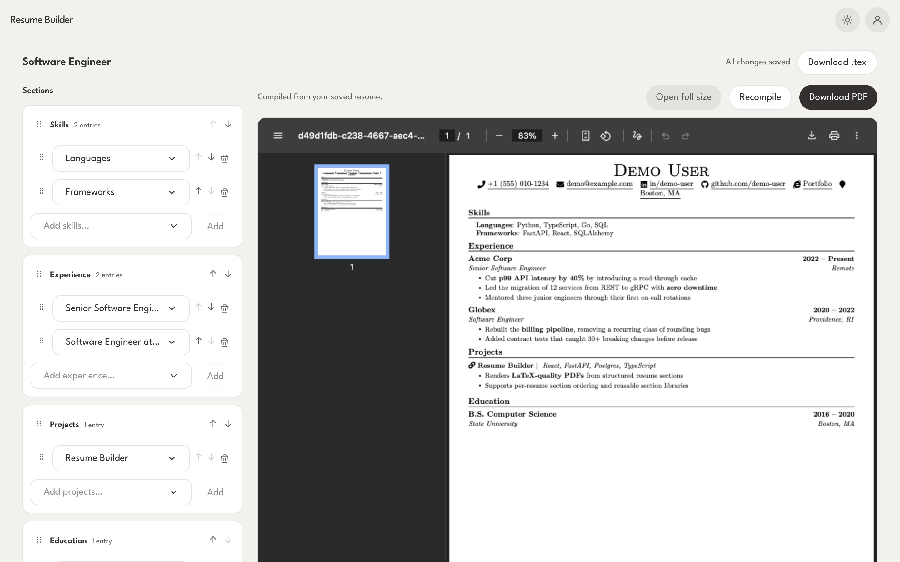
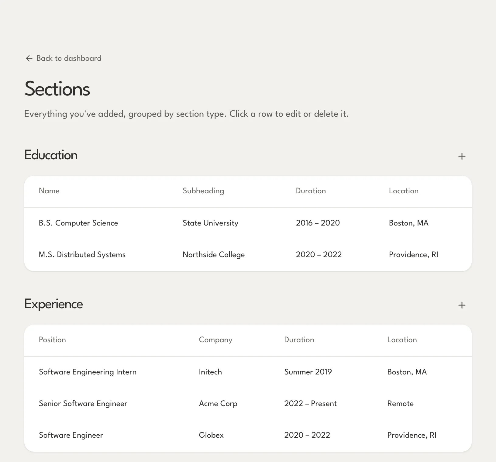
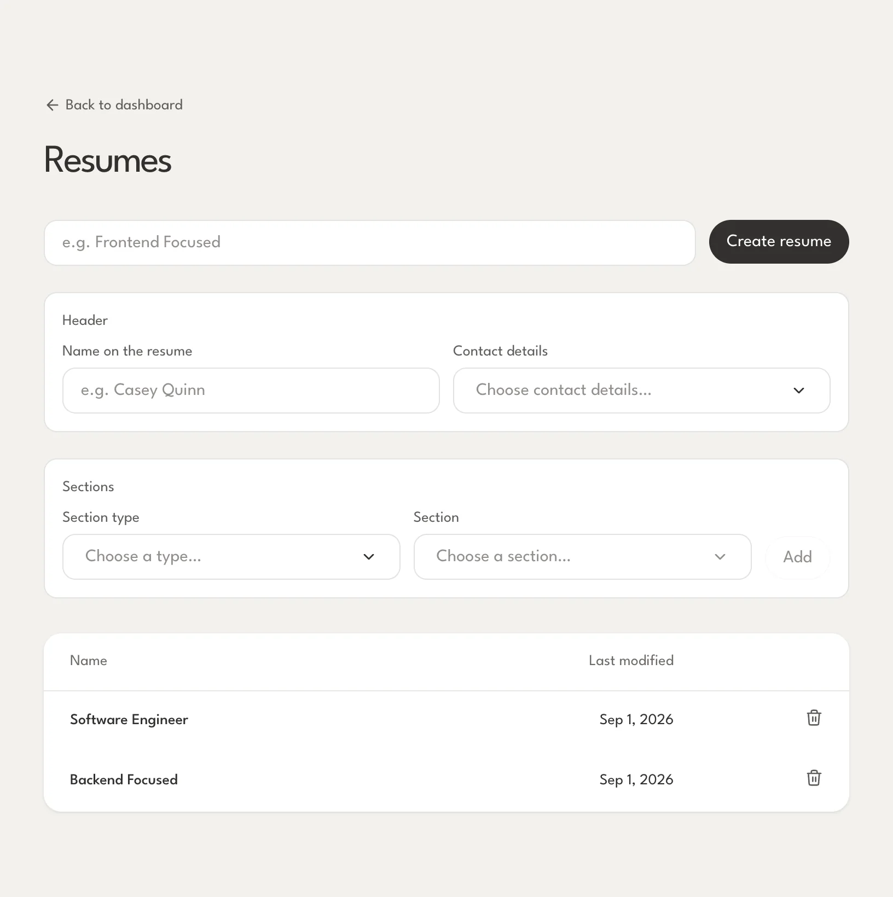
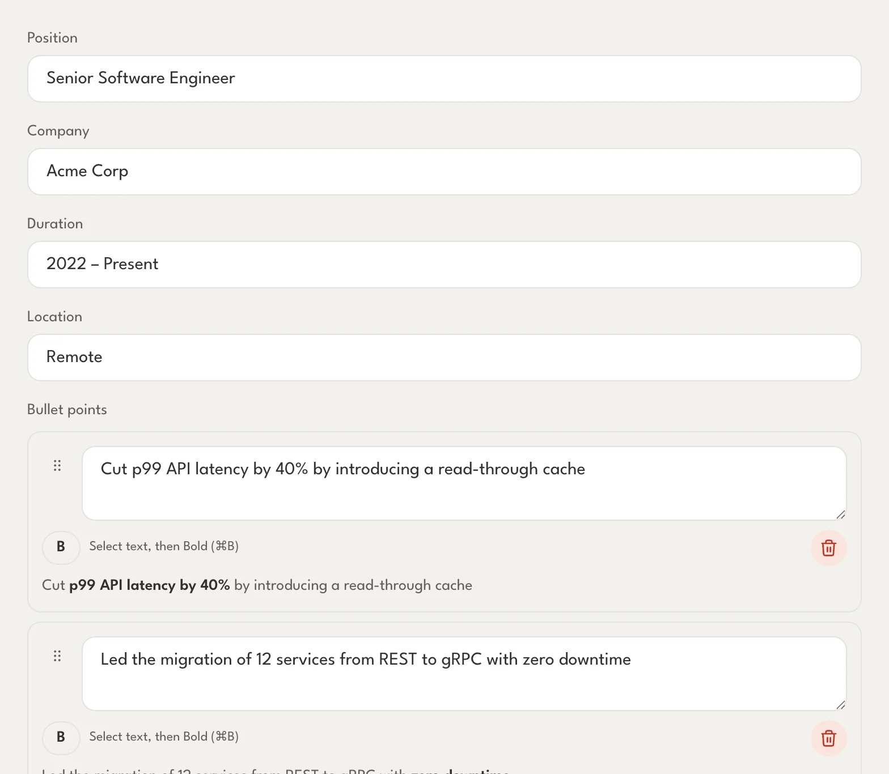
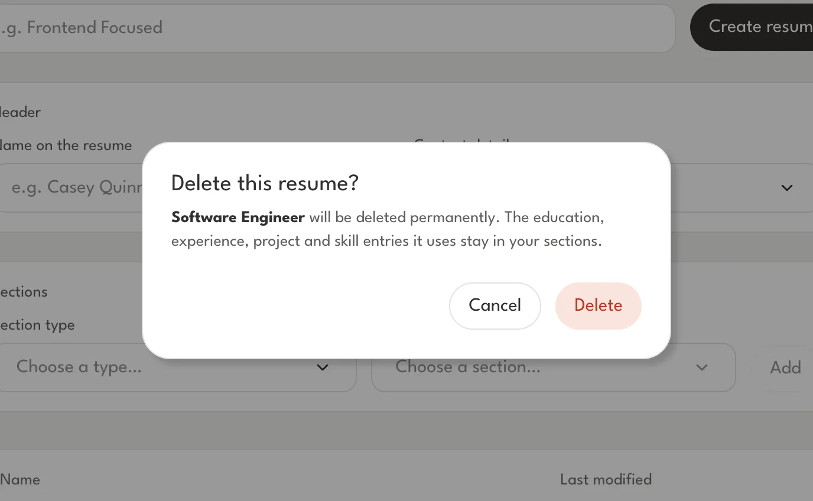
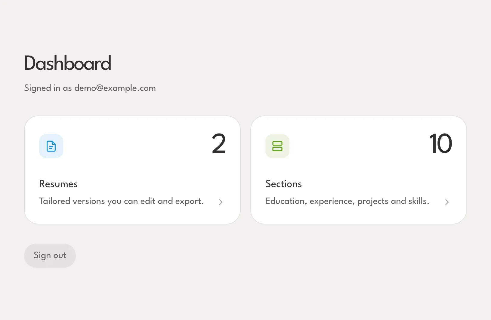
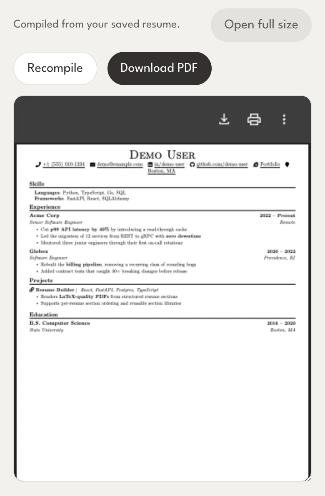
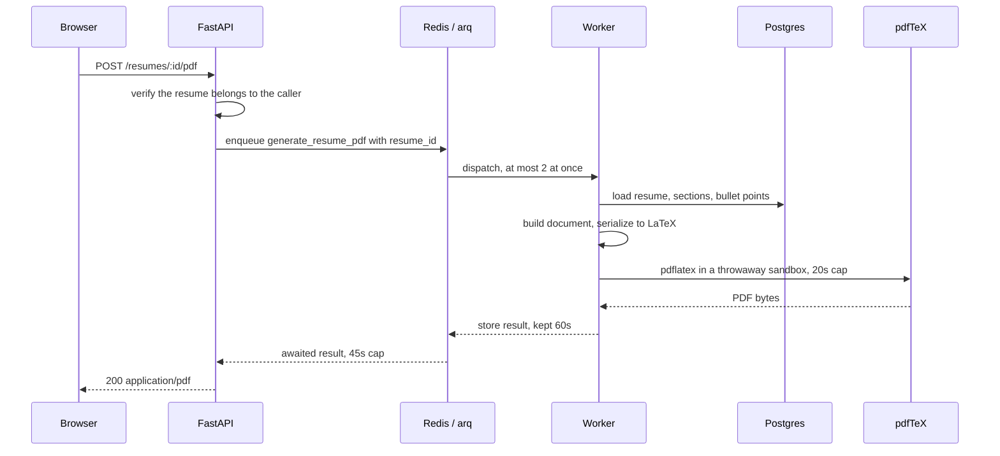

# Resume Builder

Keep every role, project and bullet point in one library, then tailor a
LaTeX-typeset resume for each application without losing the original.

<picture>
  <source media="(prefers-color-scheme: dark)" srcset="apps/web/public/shots/dark/editor.webp">
  
</picture>

## What it is

Most resume tools make you keep a separate copy of your history for every
version of your resume, and the copies drift. This one inverts that: your
experience lives in one library, and a resume is a *selection and ordering* of
things already in it.

Add a role once. Use it in the frontend-focused resume and the backend-focused
one. Fix a typo in the library and both follow along, because neither of them
holds a copy — they hold a reference.

The output is not an HTML approximation of a resume. It is a real PDF, typeset
by pdfTeX from generated LaTeX, produced by a background worker. See
[the PDF pipeline](#how-the-pdf-gets-made).

## The product

### One library behind every resume

Education, experience, projects, skills and contact details live in a single
place, grouped by type.

<picture>
  <source media="(prefers-color-scheme: dark)" srcset="apps/web/public/shots/dark/sections.webp">
  
</picture>

### A version for every application

A resume picks sections out of that library and puts them in the order it
wants. Each one keeps its own selection, its own ordering and its own header,
so tailoring one leaves the others exactly as they were.

<picture>
  <source media="(prefers-color-scheme: dark)" srcset="apps/web/public/shots/dark/resumes.webp">
  
</picture>

### Bullets that carry emphasis

Bullet points support bold spans — select a phrase, press ⌘B — with a live
preview of how the line will typeset. Bullets drag to reorder, and so do whole
sections.

<picture>
  <source media="(prefers-color-scheme: dark)" srcset="apps/web/public/shots/dark/section-form.webp">
  
</picture>

### Careful with the destructive paths

Deleting a resume says which one, and what survives it — the sections it used
stay in the library.

<picture>
  <source media="(prefers-color-scheme: dark)" srcset="apps/web/public/shots/dark/confirm.webp">
  
</picture>

### At a glance, and on a phone

<table>
<tr>
<td width="55%" valign="top">
<picture>
  <source media="(prefers-color-scheme: dark)" srcset="apps/web/public/shots/dark/dashboard.webp">
  
</picture>
</td>
<td width="45%" valign="top">
<picture>
  <source media="(prefers-color-scheme: dark)" srcset="apps/web/public/shots/dark/editor-mobile.webp">
  
</picture>
</td>
</tr>
</table>

The whole app reflows to a single column on small screens, and follows your
system light/dark preference or an explicit toggle.

## How the PDF gets made

Typesetting is slow and bursty — a run is CPU-bound for a second or two — so it
does not belong on the request path. The API hands the job to a **Redis-backed
[arq](https://arq-docs.helpmanual.io/) queue** and a separate **worker process**
does the work.



**The job carries a resume id and nothing else.** It re-reads the rows itself
rather than trusting a document sent in from outside, so there is no
caller-supplied LaTeX anywhere in the pipeline — which is what lets the compile
step drop the token and network fencing a standalone service would need.
Ownership is settled by the endpoint before the job is ever enqueued.

**The queue bounds work rather than hiding it.** The request waits for its own
result, because the client asked for a file and gets one in the same response.
What the queue buys is `max_jobs = 2`: a compile is CPU-bound, so running more
at once makes each one slower rather than finishing sooner, and unbounded
exports would take the host down instead of merely queueing. Jobs run with
`max_tries = 1` — the document is identical on a retry, so a retry cannot fix
what failed.

**Each compile is sandboxed.** The engine runs as a child process of the worker
inside a temporary directory that is deleted afterwards, with:

| Fence | Why |
| --- | --- |
| `openin_any=p`, `openout_any=p` | paranoid mode — `\input{/etc/passwd}` cannot reach the PDF |
| `-no-shell-escape` | no `\write18`, whatever the document says |
| a minimal environment | the engine inherits none of the worker's variables, so a stray secret cannot leak into a document |
| `-halt-on-error` | fail on the first error instead of cascading |
| 20s timeout, own process group | a hung run is killed along with anything it spawned |
| `SOURCE_DATE_EPOCH=0` | identical input produces an identical file |

**The engine has to be pdfTeX.** The template calls `\pdfgentounicode`, a pdfTeX
primitive that emits the glyph-to-Unicode map making the PDF readable by
applicant tracking systems — which for a resume is close to the whole point.
XeTeX-based engines such as Tectonic reject it.

Failures come back as themselves rather than a generic 500: a document the
engine rejected returns `422` with the tail of the TeX log, a missing engine or
a down queue returns `503`, a compile that outlives the wait returns `504`, and
a resume deleted between enqueueing and running returns `404`.

Relevant code:

| | |
| --- | --- |
| [`routers/resume.py`](apps/api/routers/resume.py) | the endpoint that enqueues and waits |
| [`services/compiler_worker.py`](apps/api/services/compiler_worker.py) | the job, and the worker's settings |
| [`services/compiler.py`](apps/api/services/compiler.py) | the sandboxed pdfTeX run |
| [`services/latex/`](apps/api/services/latex) | document → LaTeX source |
| [`worker.py`](apps/api/worker.py) | the worker entrypoint |
| [`deps/redis.py`](apps/api/deps/redis.py) | the sync and arq Redis pools |

## Stack

| | |
| --- | --- |
| Web | React 19, React Router 8, TanStack Query + Form, Tailwind 4, Vite |
| API | FastAPI, SQLAlchemy 2, Alembic, Pydantic v2 |
| Data | Postgres 16 hosted, SQLite on the desktop; Redis |
| Jobs | arq worker, pdfTeX |
| Tooling | Bun workspaces, uv, Biome, Ruff, mypy, pytest |

The application is one React app and one API, each deployed two ways. The app
is `packages/ui`, and `apps/` holds only what differs between deployments — so
a change to a screen reaches the browser and the desktop at once, rather than
being made twice and drifting.

```
packages/
  ui/           the React Router app, shared by both deployments
    app/routes/     pages
    app/components/ shared UI
    app/lib/        LaTeX serialization, resume documents
    app/api/        generated OpenAPI types + client
apps/
  api/          FastAPI service, worker, migrations
    routers/    HTTP endpoints
    services/   compile pipeline, LaTeX serialization, sections
    models/     SQLAlchemy tables
    schemas/    Pydantic request/response types
  web/          the browser deployment: Dockerfile, nginx, screenshots
```

The API is the same in both too. `MODE=cloud` is the hosted service — Postgres,
a queue, accounts. `MODE=local` is the copy the desktop app embeds: one SQLite
file, nobody signed in, and typesetting done in-process. The routers, services
and schemas are the same code either way.

## Getting started

### Everything in one command

```bash
docker compose up --build
```

That builds and starts the whole application — Postgres, Redis, the API, the
PDF worker and the web app — and applies the migrations on the way up. The app
is at http://localhost:5173 and the API at http://localhost:8000; create an
account from the sign-in page.

No `.env` is needed: `docker-compose.yml` defaults every setting. Drop one at
the repo root (see `.env.example`) to change ports or the database credentials,
or to fill in `GOOGLE_CLIENT_ID` / `GOOGLE_CLIENT_SECRET` for Google sign-in.
Database and queue data live in named volumes and survive `docker compose
down`; `down -v` is what throws them away.

The image the API and worker share carries a TinyTeX install with just the
packages the resume template loads, so `pdflatex` is there without a TeX Live
install on your machine.

> This runs the app, not a development loop: the web bundle is built into the
> image and the API runs without `--reload`, so code changes need a rebuild.
> For day-to-day work use the setup below, which runs only the backing services
> in Docker.

### Running it for development

From a fresh clone:

```bash
cp .env.example .env      # dev defaults work as-is
bun install
uv sync --directory apps/api
bun run docker:dev        # postgres + redis + cloudbeaver; leave this running
bun run db:upgrade        # apply migrations
bun run db:seed           # sample data + demo account
```

Then, in three more terminals:

```bash
bun run dev:api           # http://localhost:8000
bun run dev:web           # http://localhost:5173
cd apps/api && uv run python worker.py    # the PDF worker
```

Sign in at http://localhost:5173 as **demo@example.com** / **demo1234**.

> The worker is a separate process. Without it the app runs fine, but the PDF
> preview and export sit unresolved until the request times out — if the editor
> reports that the last compile failed, check that it is running. It also needs
> `pdflatex` on `PATH` (a TeX Live install); the endpoint returns `503` when the
> engine is missing.

### Sample data

`bun run db:seed` fills the database with one demo user and a realistic spread
of sections (personal info, educations, experiences with bolded bullet points,
projects, skills) plus two resumes built from them.

Every seeded row has a deterministic id, so re-running the seed deletes exactly
the rows it owns and reinserts them — anything you created by hand is left
alone. It is safe to re-run whenever you want a clean baseline, and it refuses
to run unless `NODE_ENV=development`. The demo account's password is committed
in the seed script; it is a development fixture and must never exist in a
deployed environment.

To change the sample data, edit `apps/api/scripts/seed.py` and re-run the seed.

### Looking at the database

CloudBeaver runs at http://localhost:8978 with the connection **Resume Builder
(dev)** already created (see `docker/cloudbeaver/initial-data-sources.conf`).
The username is filled in; enter `POSTGRES_PASSWORD` from your `.env` on first
connect and CloudBeaver remembers it.

The connection is created from the committed config only when the CloudBeaver
workspace volume is empty, so it appears on a fresh clone and never overwrites
connections you have saved. To get it back after changing that file:

```bash
docker compose -f docker-compose.dev.yml rm -sf cloudbeaver
docker volume rm resume-builder_cloudbeaver_workspace
bun run docker:dev
```

For a shell instead:

```bash
docker compose -f docker-compose.dev.yml exec postgres psql -U resume_user -d resume_db
```

## API client

The frontend's types are generated from the FastAPI OpenAPI spec by
[openapi-typescript](https://openapi-ts.dev/), and consumed through
`openapi-fetch` / `openapi-react-query`. The generated file is committed, so
regenerate it whenever a route or schema changes:

```bash
bun run codegen
```

It reads `http://localhost:8000/openapi.json`, so the API must be running.

The output is a single file, `packages/ui/app/api/schema.d.ts` — never edit it
by hand, since the next codegen run overwrites it. The typed client built on
top lives in `packages/ui/app/api/api.ts`.

## Checks

```bash
bun run test              # pytest + bun test
bun run verify            # format, lint and typecheck both apps
```

The API tests run against a throwaway SQLite file and need nothing started.
Set `TEST_DATABASE_URL` to run the same suite against a Postgres — the hosted
app's database — which is worth doing before changing a model.

## Landing page screenshots

The screenshots on the marketing page — and in this README — are captures of
the running app, regenerated by a script rather than taken by hand:

```bash
bun run apps/web/scripts/capture-shots.mjs
```

It needs the full stack running (including the worker, for the PDF preview) and
`cwebp` on `PATH`. See the header of
[`capture-shots.mjs`](apps/web/scripts/capture-shots.mjs) for the details.
